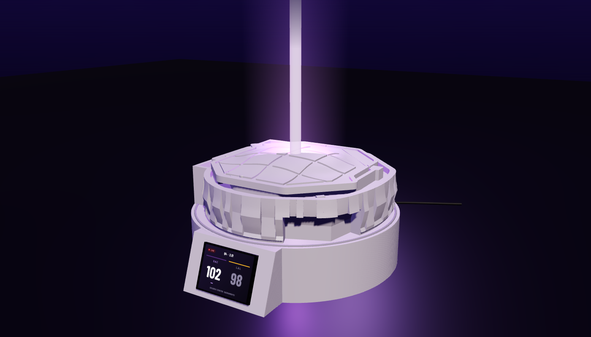
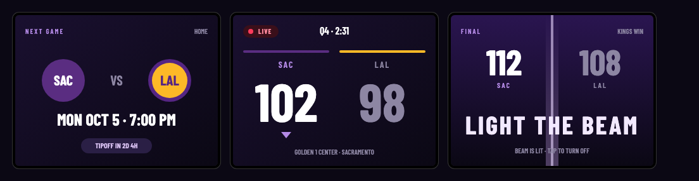
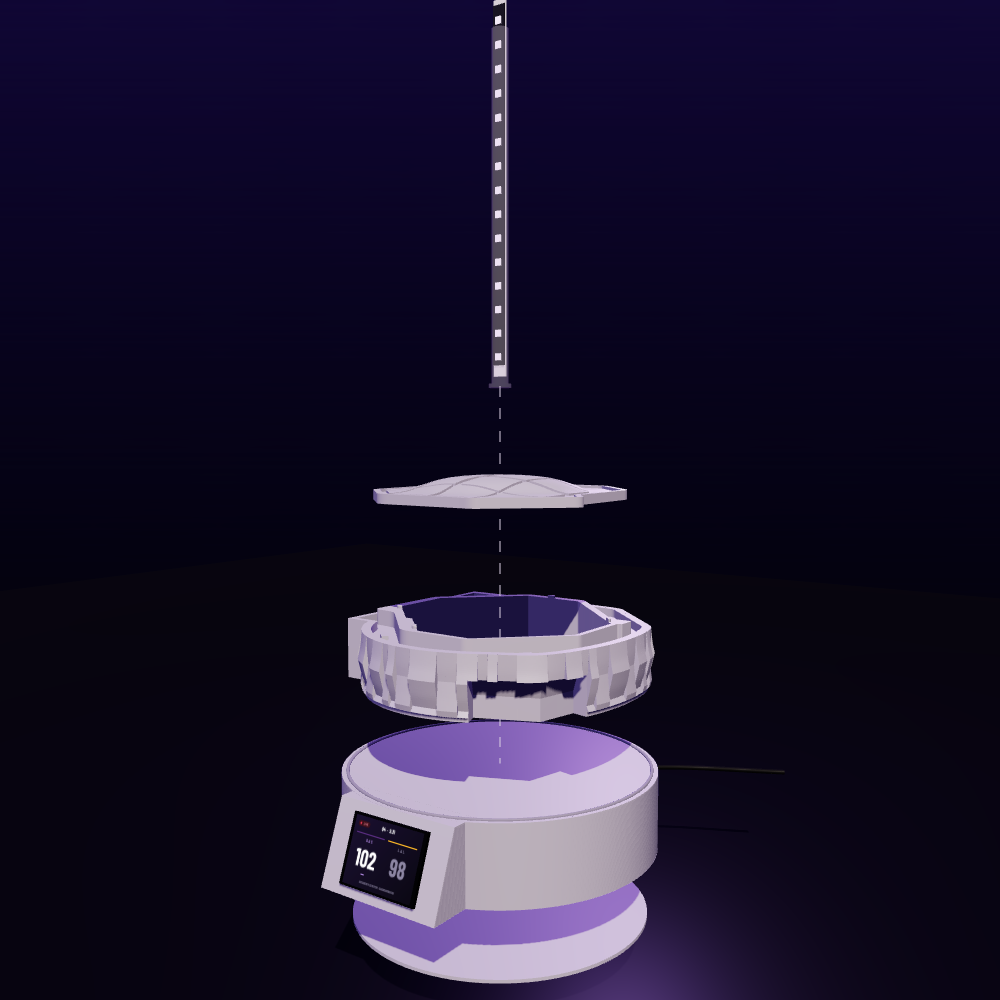
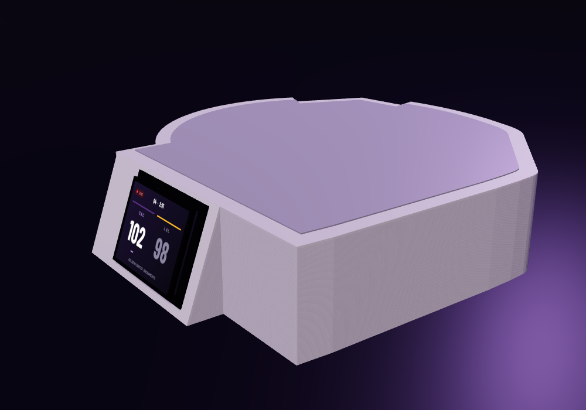

# Light the Beam

A 3D-printed Golden 1 Center that lights its purple beam when the Sacramento Kings win, with a live scoreboard in the base.

[](https://github.com/zacharygking/light-the-beam/actions/workflows/ci.yml)



The arena base is [Dave Lack's free Printables model](https://www.printables.com/model/338758-golden-1-center-light-the-beam), printed unmodified (the lid gets one hole). Everything else is this repo: a printed plinth with a sloped console that holds a 2.8" ESP32 touch display, a 14-LED beam in a single-wall diffuser tube, firmware that reads ESPN's public scores over WiFi, and the documents to build it without soldering.

## What it does



| | |
|---|---|
| **Next game** | Opponent logo, home or away, tipoff in Pacific time, countdown. Polled every 10 minutes, every 30 seconds near tipoff. |
| **Live** | Score, quarter and clock every 20 seconds. Leader in white, trailer in grey. Halftime and overtime are labelled; scores animate when they change. |
| **Final** | If the Kings win, the beam rises from the base like the real one and holds purple for up to 12 hours. |
| **Touch** | Tap to light the beam yourself. Hold for a second to step brightness. |
| **Setup** | First boot opens a `KingsBeam-Setup` WiFi network; join it from a phone and pick your home WiFi. Nothing is typed into code. |
| **Night** | Screen dims 11 pm to 7 am and whenever the room is dark. |

## How it's built



- **Plinth** ([`models/plinth.scad`](models/plinth.scad)): a 56 mm stand that follows the arena's measured footprint, with a console on the front whose face leans back 20° so the screen points at you at a desk. Three parts, each printable without supports: a wall ring with the console, a flat top plate whose recess is cut to the footprint (so the arena only fits one way) with a slot under the arena's own wire channel, and a bottom lid. The board slides up into the console with its USB plug attached; the lid closes the pocket.
- **Beam** ([`models/beam_tube.scad`](models/beam_tube.scad), [`models/strip_holder.scad`](models/strip_holder.scad)): a 250 mm tube printed in vase mode from white PLA, with the WS2812B strip on a printed spine inside and a socket glued in the arena's well.
- **Board**: ESP32-2432S028R, the "Cheap Yellow Display". Three lever-nut connections to the strip: 5 V, ground, data on GPIO 22.
- **Firmware** ([`firmware/`](firmware/)): PlatformIO, Arduino framework. LVGL 9 UI with Barlow Condensed fonts and all 30 team logos baked in, FastLED for the beam, WiFiManager for the captive portal, ArduinoJson with a filter for the 21 KB ESPN response. A `cyd_demo` build cycles the three screens without WiFi.



## Documents

| | |
|---|---|
| [**Build guide** (PDF)](docs/kings-beam-assembly.pdf) | 15 pages, 22 steps with diagrams: print, flash, beam, arena and plinth, WiFi setup, troubleshooting. |
| [**Overview** (PDF)](docs/kings-beam-overview.pdf) | What it is and how it works, in five pages. |
| [**Shopping list** (PDF)](docs/kings-beam-shopping-list.pdf) · [HTML](docs/shopping-list.html) | Four hardware items in one Amazon cart link, filament, free downloads, local pickup in San Francisco. |
| [**Bill of materials**](docs/bom.md) | Sourcing notes, alternatives, prices with tax, wiring table. |

Hardware is about **$41 with tax**, everything bought new; filament is separate.

## Building it yourself

```sh
# Firmware (PlatformIO; `pip3 install --user platformio` if you don't have it)
cd firmware
pio test -e native                 # parser tests against captured ESPN responses
pio run -e cyd_demo -t upload      # demo build first: cycles NEXT → LIVE → FINAL, no WiFi
pio run -e cyd -t upload           # the real thing
pio device monitor -b 115200

# Models (OpenSCAD 2021.01 or newer)
python3 tools/measure_arena.py     # reads the downloaded arena STL, writes the footprint outline
cd models && make                  # exports plinth, lid, console test part, tube, spine, socket

# Everything at once
tools/validate.sh                  # tests, both firmware builds, exports, PDFs, link check
```

Print the console test part (`plinth_test.stl`, about 40 minutes) before the full plinth to confirm the board fit. The [build guide](docs/kings-beam-assembly.pdf) has the rest.

## Repository

| Path | What |
|---|---|
| `firmware/` | PlatformIO project: `src/` (UI, beam, touch, network, parser), `include/lv_conf.h`, `test/` (native Unity tests + real ESPN fixtures) |
| `models/` | OpenSCAD sources, `exports/` STLs, `printables/` for the downloaded arena files, `arena_outline.scad` (measured footprint) |
| `tools/` | `espn_probe.py`, `make_fixtures.py`, `check_fixtures.py`, `make_fonts.py` (TTF → LVGL, no Node needed), `make_logos.py`, `measure_arena.py`, `render_views.sh`, `validate.sh` |
| `docs/` | Guides and BOM, `render/` (three.js scene that renders every view through headless Chrome) |
| `.github/workflows/ci.yml` | Native tests, both ESP32 builds, generator reproducibility, OpenSCAD export |

## Notes from building it

- **ESPN's edge returns 403 to browser-looking user agents from non-browser clients.** The stock `ESP32HTTPClient` and `python-urllib` user agents pass. The firmware never spoofs a browser.
- ESPN's document nests 14 levels deep; ArduinoJson's default limit is 10. With a filter, ArduinoJson also reports success on non-JSON input, so the parser checks for the team object explicitly.
- The team endpoint omits opponent colours for upcoming games, so team colours ship with the logos.
- Fonts are converted from TTF to LVGL's bitmap format with a 150-line Python script, which keeps Node out of the toolchain.
- The renders are a three.js scene rasterised by headless Chrome's software WebGL. Once the Printables STL was downloaded, the scene loads the real mesh, and the same slicer measured the arena for the plinth.

## Status

Firmware builds and the parser is tested against real responses, but nothing has run on hardware yet. The three things most likely to need a tweak on first flash are display rotation, the touch pressure threshold, and the first LED's data level. The preseason opener is October 5, 2026 (LAL @ SAC); the live and final screens get their first real data then.

## Live win probability (v2, on the bench)

A four-coefficient logistic model of the home team's chance to win from the score, clock and period, the fields the firmware already polls, so it adds no requests. It was fitted on every play of the 2024-25 season and evaluated on every play of 2025-26, with ESPN's own in-game win probability recorded on the same plays as the benchmark:

| | Brier (lower is better) | log loss |
|---|---|---|
| this model | 0.162 | 0.476 |
| ESPN | 0.147 | 0.442 |
| home-court prior only | 0.247 | 0.687 |

The gap to ESPN is pregame information (team strength, possession): three Brier points in the first quarter, one thousandth by the fourth. Details, calibration table and next steps are in [docs/winprob.md](docs/winprob.md).

The bench is C++: `firmware/src/winprob.h` is the exact function the ESP32 will run, and `pio test -e native -f test_winprob` checks it against the Python trainer on 300 sampled plays, checks its shape (symmetry, monotonicity, end points), and replays all 641,199 held-out plays through it, asserting the Brier, fourth-quarter and calibration numbers above. It runs in CI. Data comes from `tools/fetch_pbp.py` (see [data/README.md](data/README.md)); `tools/train_winprob.py` refits and regenerates the header, fixtures and report. Not wired to the screen yet; that is a pill under the live score once the hardware is up.

## Credits

Arena model by [Dave Lack](https://www.printables.com/@DaveLack_475585) on Printables. Scores from ESPN's public API. Team logos are NBA/ESPN property, embedded for personal use. Barlow Condensed by Jeremy Tribby, SIL Open Font License. Built with [PlatformIO](https://platformio.org), [LVGL](https://lvgl.io), [FastLED](https://fastled.io), [ArduinoJson](https://arduinojson.org), [WiFiManager](https://github.com/tzapu/WiFiManager), [OpenSCAD](https://openscad.org) and [three.js](https://threejs.org).
